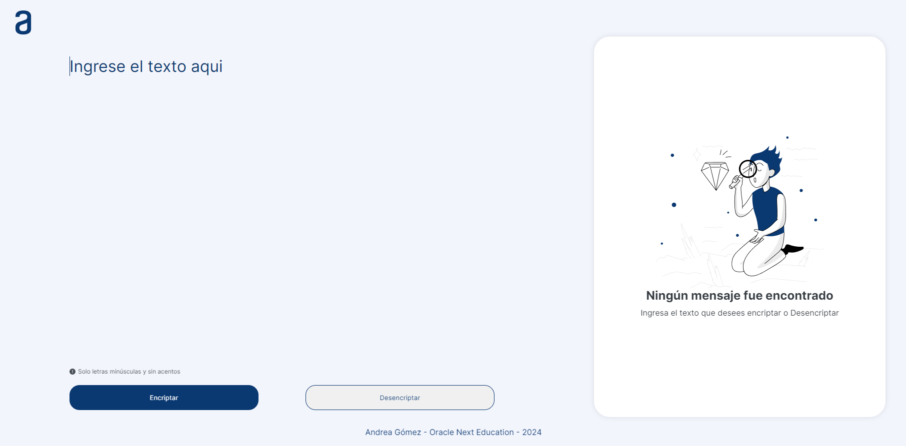
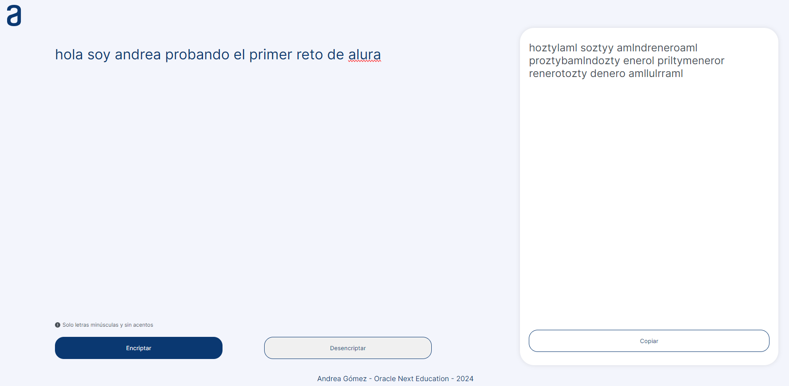
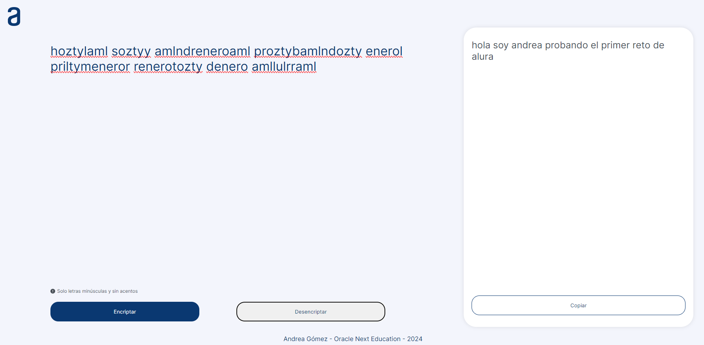
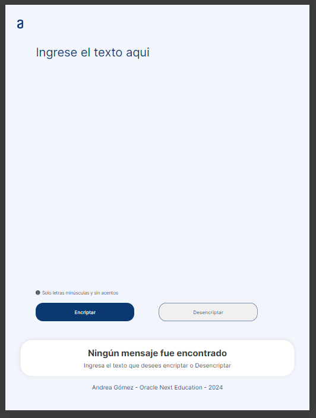
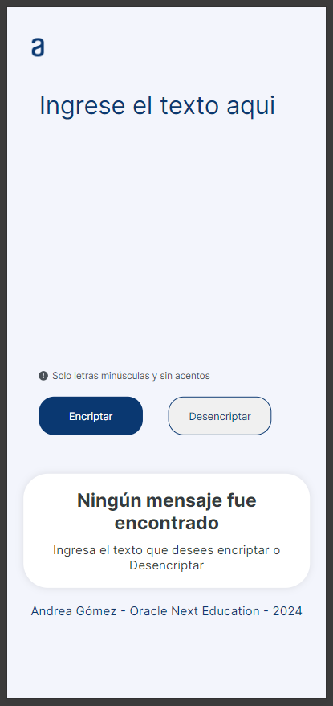

# alura-callenge-1
<h1>Alura challenge 1 - Encrypt/Decrypt text</h1>

This checllenge is to Encryp or Decrypt a given text.

As you can see in the following image when you give a text and then clic on "Encriptar" button you can see that on right level appears the encripted text:

When you copy the encripted text toy can decrypt it when you clic on "Desencriptar" button:

Finally, if you use it on tablets or cellphones you can use it too, because of it's responsive:

This is the first challenge overview.

Andrea Gomez - 2024